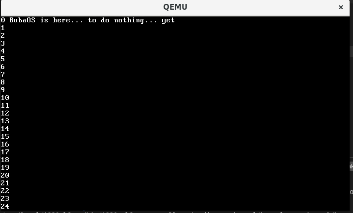

# Buba OS

The simple OS is written from scratch in Assembly and C for x86 architecture. Project for "Basic of programming 1" course at Budapest University of Technology and Economics (BME).

Based on [os-tutorial](https://github.com/cfenollosa/os-tutorial) repo with some parts reworked and new added.

## Table of Contents

1. [Goal](#goal)
2. [System features](#features)  
3. [Project structure](#structure)
4. [Development](#dev)  
5. [Resources](#resources)

## Goal

The goal is to learn how operating systems are working by making a simple OS.
The development includes using Assembly and C programming languages, and concepts like boot sector, stack, interrupt, kernel, linked lists. No advanced OS development techniques/tools are used, everything is built from scratch. The system is not indented for production use and it does not serve any other goal except educational.

## System features

The system is able to run using QEMU (or other virtual machine). The system consist of:

- boot sector (written in Assembly)
- simple kernel, and dynamic memory allocation (written in C)
- IRQs (written in Assembly and C)
- minimal keyboard and VGA screen drivers (written in C)
- simple shell (written in C)
- minimal ATA driver for reading and writing from hard drive (written in C)

### Dynamic memory allocation

Dynamic memory allocation is implemented using linked list of memory sector (MEM_SEC) structs with default page size of 512B. Memory sectors could be reused or added. Two public functions are available in `libc/mem.c`: `kmalloc` and `free`.

### ATA driver

As the first part towards filesystem, simple ATA driver was created. All necessary information about ATA interface were taken from OSDev wiki [article](https://wiki.osdev.org/ATA_PIO_Mode). Currently, driver is working only with primary drive, it can read and write sectors in PIO mode.

## Project structure

Root files structure:

- `boot/` - Assembly code related to booting and loading kernel.
- `cpu/` - x86 CPU architecture related code (ports, IRQ, ISR)
- `drivers/`- screen, keyboard and ATA drivers
- `kernel/` - kernel code
- `libc/` - functions to work with strings, memory, etc.
- `Makefile` - file with commands to compile and execute OS image using QEMU

## Development

### How to run

1. Install `qemu` ([download page](https://www.qemu.org/download/)).
2. Download `os-image.bin` file from the release page.
3. In console, run `qemu-system-i386 -drive if=ide,format=raw,file=os-image.bin,readonly=off`.

### How to setup development environment

Follow [this](https://github.com/cfenollosa/os-tutorial/tree/master/00-environment) and after [this](https://github.com/cfenollosa/os-tutorial/tree/master/11-kernel-crosscompiler) tutorial to install necessary libraries.

Commands:

- `make run` - to compile and run.
- `make debug` - to compile and run with GDB debugging.

<a name="resources"/>

## Resources

- https://github.com/cfenollosa/os-tutorial
- https://wiki.osdev.org/
- http://www.cs.bham.ac.uk/~exr/lectures/opsys/10_11/lectures/os-dev.pdf
- [good overview of registers](https://wiki.skullsecurity.org/Registers)
- [nice nasm tutorials](https://cs.lmu.edu/~ray/notes/nasmtutorial/)
