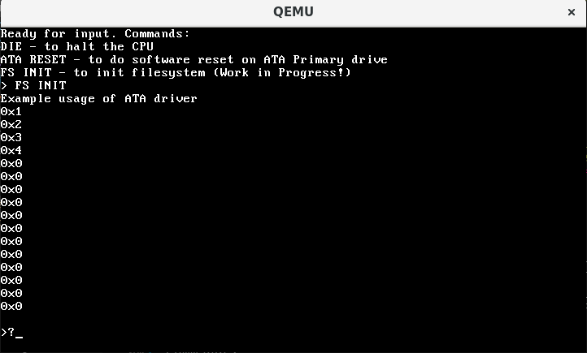

# Buba OS

The simple OS is written from scratch in Assembly and C. Project for "Basic of programming 1" course at Budapest University of Technology and Economics (BME).

## Table of Contents

[Goal](#goal)  
[System structure](#structure)
[Development](#dev)  
[Resources](#resources)

## Goal

The goal is to learn how operating systems are working by making a simple OS.
The development includes using Assembly and C programming languages, and concepts like boot sector, stack, interrupt, kernel. No advanced OS development techniques/tools are used, everything is built from scratch. The system is not indented for production use and it does not serve any other goal except educational.

<a name="structure"/>

## System structure and features

The system will be able to run using QEMU (virtual machine) or live USB stick. The system will consist of:

- boot sector, written in Assembly
- kernel + shell, written in C
- simple filesystem (?)

The shell will have a few simple commands that are able to print on the screen or read user input.

<a name="dev"/>

## Development

Instructions are only for Linux OS.

### How to run (for users)

1. You need to have `qemu` installed on your system.
2. Download `os-image.bin` file from the release page.
3. In console, run `qemu-system-i386 -fda os-image.bin`.

### How to run (for development)

In progress...

<a name="resources"/>

## Resources

- https://github.com/cfenollosa/os-tutorial
- http://www.cs.bham.ac.uk/~exr/lectures/opsys/10_11/lectures/os-dev.pdf
- https://wiki.osdev.org/Main_Page
- [good overview of registers](https://wiki.skullsecurity.org/Registers)
- [nice nasm tutorials](https://cs.lmu.edu/~ray/notes/nasmtutorial/)
